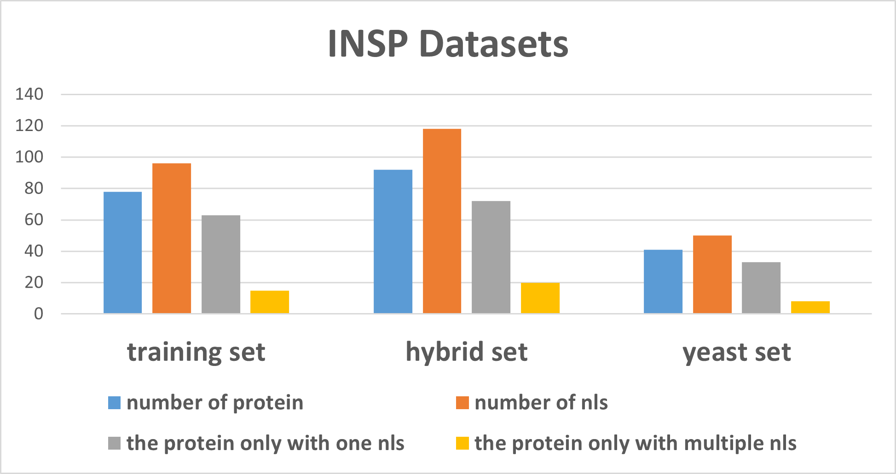

# Train a A2KA on NLSExplorer-p dataset
note that you firstly need to download NLSExplorer-t from http://www.csbio.sjtu.edu.cn/bioinf/NLSExplorer/dataset_new.html
and extract it at "./Dataset".



befor you begin to train, you should make sure you have already set python environment rightly according to 
https://github.com/Dsadd4/NLSExplorer_1.0.

Then lets go! the training script was already made by us.
```bash
conda activate pyto
python A2KA_train.py
```


