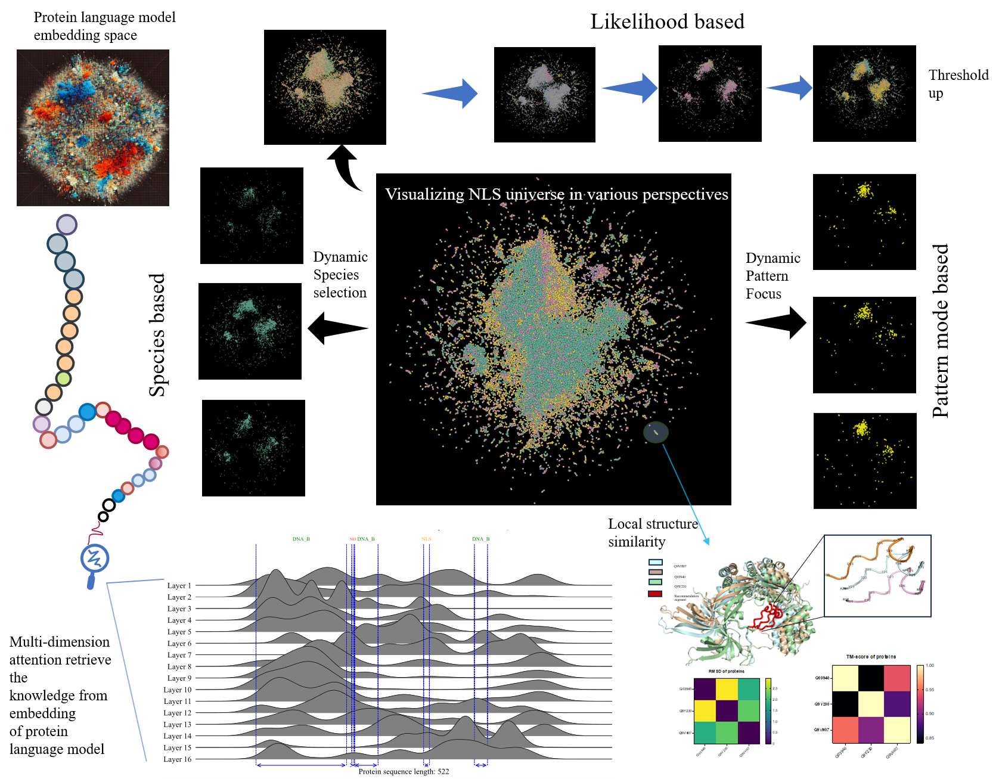
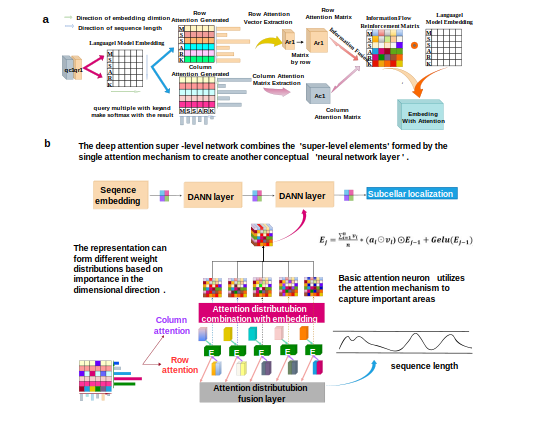
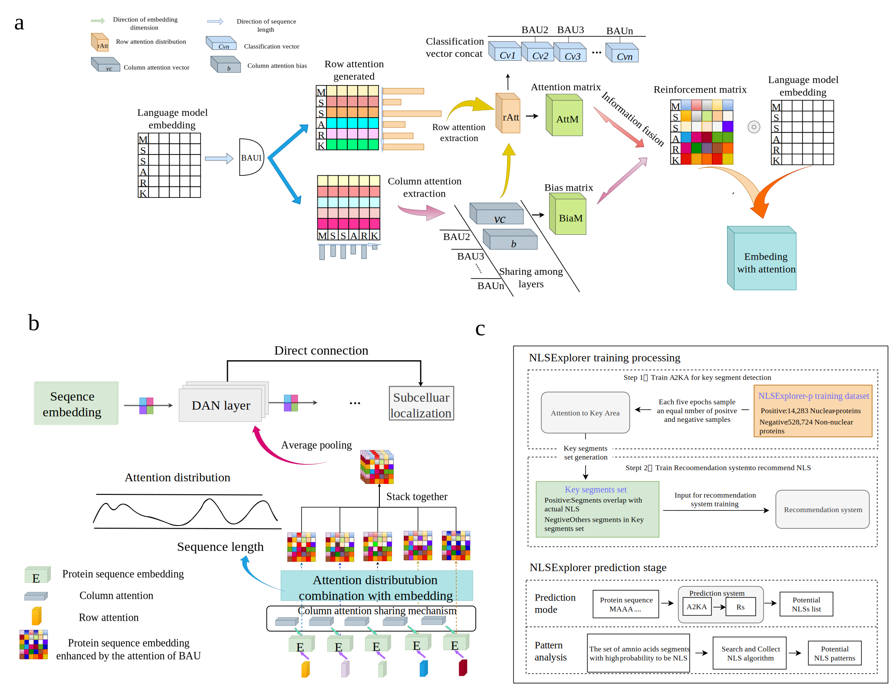
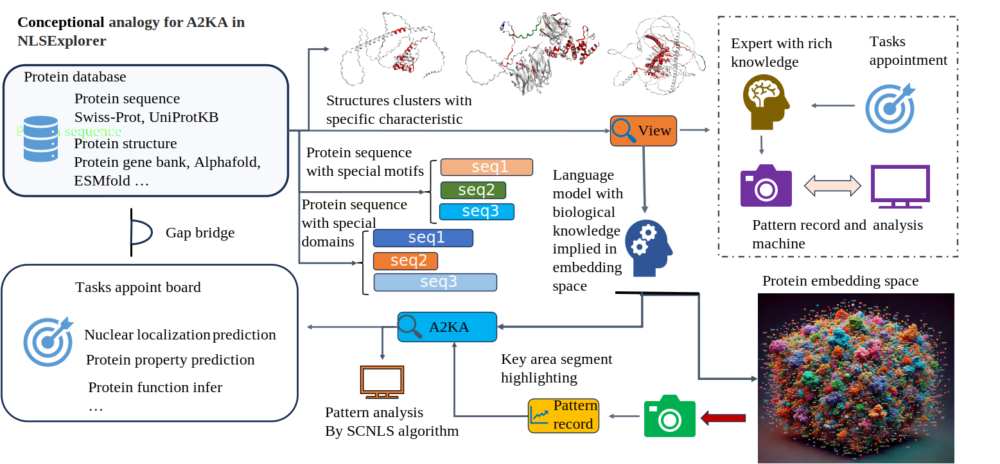

# Discovering nuclear localization signal universe through a novel deep learning model with interpretable attention units




See the detailed introduction at http://www.csbio.sjtu.edu.cn/bioinf/NLSExplorer/introduction_new.html
<br>
Free online website with interactive maps and calculation service http://www.csbio.sjtu.edu.cn/bioinf/NLSExplorer/

## Prerequisites
Ensure that Anaconda or Miniconda is installed.

## Python Environment Setup (using anaconda)
If you have already installed pytorch gpu version with python version>=3.7 successfully, you can
skip this step. 

### 1. Create Python Environment
```bash
conda create -n NLSExplorer-pyto python==3.7
```

### 2. Install PyTorch and Dependencies

```bash
conda install pytorch torchvision torchaudio cudatoolkit -c pytorch -c nvidia
```
note that this command is a general install chocice, we recommend you to https://pytorch.org/get-started/locally/
 to get the specific instruction.
```bash
conda env update -f environment-pyto.yaml
```

## File Downloads
1. Download files from [NLSExplorer Code](http://www.csbio.sjtu.edu.cn/bioinf/NLSExplorer/code.html):
   - **The NLSExplorer model**: Place NLS_loc_modeltes in the folder named "./Recommendation_system".

2. Download files from [NLSExplorer dataset](http://www.csbio.sjtu.edu.cn/bioinf/NLSExplorer/dataset_new.html): 
   - **Dataset**: Put NLSExplorer-p in the folder named "./A2KA_train/Dataset" and extract it using appropriate commands (e.g., `unzip xxx`).


## Import Attention To Key Area （A2KA） Module to various workflow
<!--  -->
A2KA is built upon a Deep Attention Network composed of basic attention units, and it serves two primary objectives. The first is to enhance the representations generated by protein language models using attention weights, supporting various prediction tasks. The second objective is to use attention maps generated by the attention mechanisms to identify key regions of the input sequence that may significantly influence prediction outcomes. 

By incorporating A2KA into your workflow, you can enhance downstream performance and output the attention distribution of various basic units in the network. This attention distribution highlights the model's key focus areas within the input space, helping users to display critical information and filter out redundant noise.



1. Make sure pytorch is already installed.

2. Once Pytorch is installed， you can directly install A2KA by run the command:
```bash
pip install A2KA
```

3. You can direcly import AK2A module , and AK2A can be specified by your own config.

4. The config means the structure of your A2KA , the length of config means the number of layers, and the value 
represents the number of basic units , for instance, the config = [8,8,32],means the structure has 3 layers,
and the the first layer includes 8 BAUs , second layer includes 8 BAUs, third layer includes 32 BAUs. 

```python
from A2KA import A2KA
import torch
hidden_dimention = 512
#configure your A2KA sturcture
config = [8,8,32]
#If your datasize is significant large, extending the scale of the network may be a good choice.
#Such a config = 18*[64] means it has 18 layers and each layer has 64 basic attention units.
model =A2KA( hidden_dimention,config)
# tensor in a shape of (Batchsize,sequence_length, embedding dimension)
exampletensor = torch.randn(5,100,512)
prediction,layerattention = model(exampletensor)
print(prediction)
print(layerattention)

```
<!-- <h2>
    
    <span style="vertical-align: middle;">Attention adapts to the need</span>
</h2> -->



For a given protein segment, the significance of each signal peptide fragment varies depending on the function of interest. Let's first assume that an expert already possesses sufficient knowledge and understanding. When presented with a set of materials, the expert's gaze will naturally focus on areas of personal interest. Simultaneously, we can assume the presence of a recorder that logs and analyzes the frequency of these patterns, thereby reflecting the expert's attention distribution throughout the test.
Now, let’s consider a different scenario: the expert's gaze is directed according to specific requirements. For example, if the task is to determine whether a protein is localized within the nucleus, the expert's attention will shift to focus on nucleus-related information.

Our model operates under the assumption that language models possess a substantial amount of knowledge. In this context:

The knowledgeable individual is replaced by a language model.
The task presented to the language model is to identify nuclear localization proteins.
The tools used to record the patterns are A2KA and SCNLS.

## A2KA with slective strate
By strategically selecting the distribution of basic units within A2KA to aggregate an overall attention distribution, A2KA can be adapted to different tasks. For example, in the task of detecting NLS, the basic units that favor amino acids K and R are more effective at accurately identifying key points of NLS. Focusing on these specific units yields better performance than considering all units equally.


## Search and collect NLS (SCNLS) algorithm 
SCNLS is designed for the pattern analysis of sequences, with its primary innovation being the ability to analyze discontinuous patterns in characteristic motifs, such as NLSs. These discontinuous patterns emphasize the core segment of NLSs, which plays a crucial role in determining their function.
<br>We provide several modes for running the SCNLS algorithm. In addition to specifying the input file path, you can directly input a sequence of interest for pattern analysis (any sequence can be analyzed). By default, the top 10 most frequent patterns are displayed. This package is designed to run on a Linux system to fully utilize multiprocessing capabilities.

```bash
python SCNLS.py --mode f  --material example.csv --maxgap 3 --kths 3 --processor 3
python SCNLS.py --mode n  --material 'Arabidopsis thaliana_0.5' --maxgap 3 --kths 3 --processor 8 
python SCNLS.py --mode s  --material KKKKRRRJJJJKSJSAIJCOSJAOJD --maxgap 3 --kths 3 --processor 1 
#or you can indicate the entropy threshold for pattern
python SCNLS.py --mode s  --material KKKKRRRJJrrJJccKSJSArrIJccCOSrrJAccOJDrrasccda --maxgap 3 --entropythreshold 0.5 --kths 3 --processor 1
```
You can directly import SCNLS into your workflow by install A2KA

```bash
pip install A2KA
```

expample:
(in linux system)
```python
from A2KA import SCNLS
#Example 
sequence_for_analysis = ['MSSAKRRKK','LSSSSKVR','MTNLP']
kth_set = 3
max_gap = 3
processorsnumber = 2
result = SCNLS(sequence_for_analysis,kth_set,max_gap,processorsnumber)
print(result)
```
## Citations <a name="citations"></a>

If you find the models useful in your research, we ask that you cite the relevant paper:

```bibtex
@article{
  author={Yi-Fan Li, Xiaoyong Pan, and Hong-Bin Shen},
  title={Discovering nuclear localization signal universe through a novel deep learning model with interpretable attention units},
  year={2024},
  doi={https://doi.org/10.1101/2024.08.10.606103},
  url={https://www.biorxiv.org/content/10.1101/2024.08.10.606103v1},
  journal={}
}
```


## License <a name="license"></a>

This source code is licensed under the MIT license.